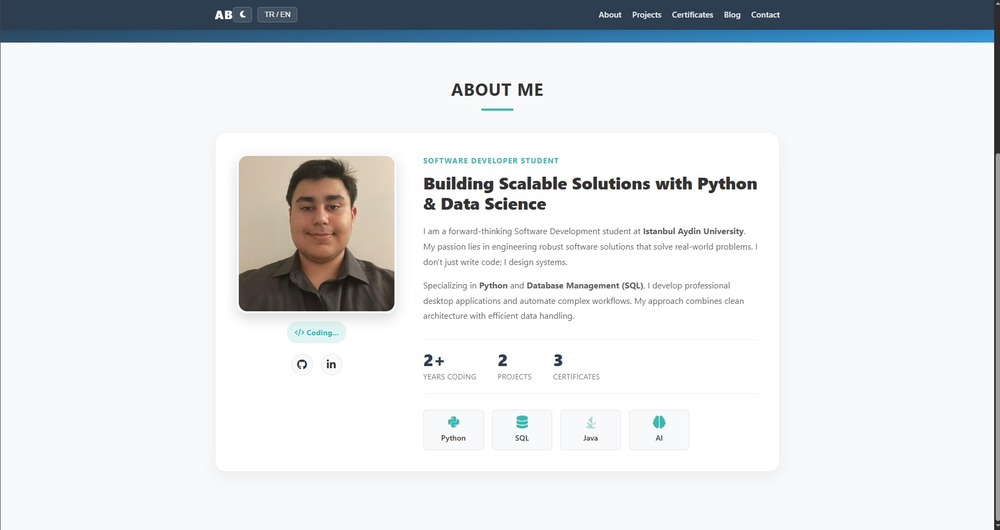
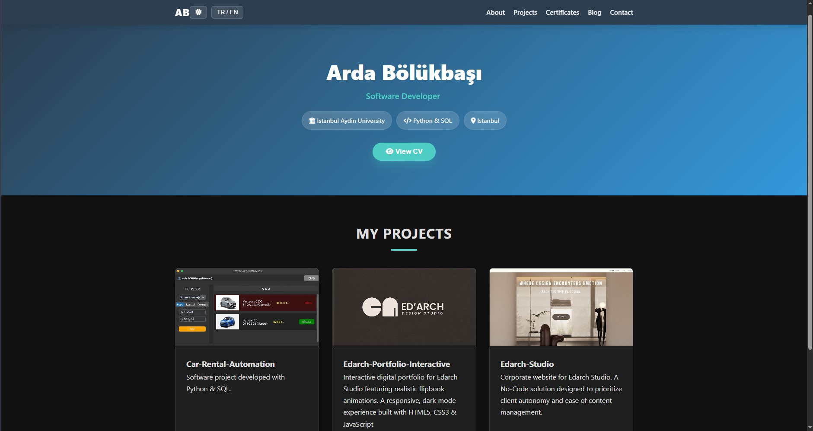
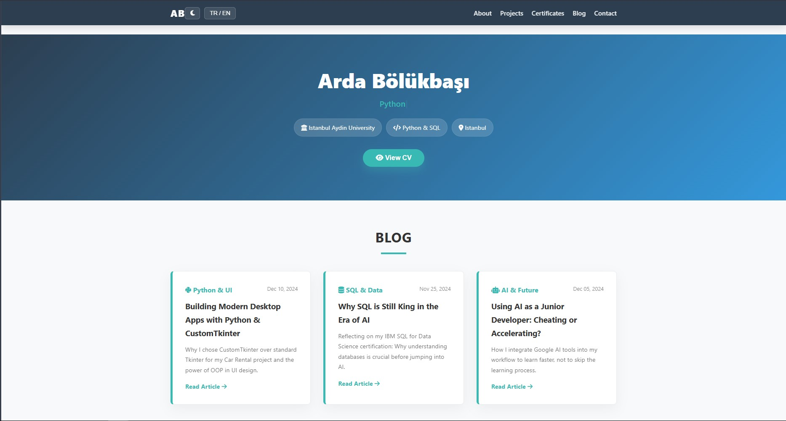
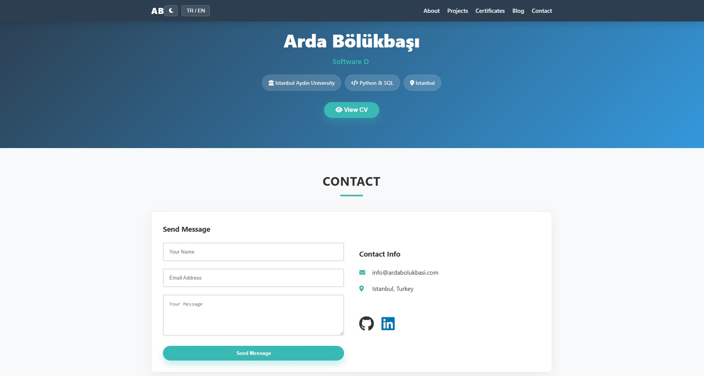

  <h1 style="font-family: 'Helvetica', sans-serif; letter-spacing: 3px; text-transform: uppercase;">
    ARDA BOLUKBASI - PORTFOLIO
  </h1>
  

    Software Development Student | Python & Data Solutions
  

  
   

  <table width="90%" style="border-collapse: collapse;">
    <tr>
      <td width="50%" align="center" style="padding: 10px;">
          <h4 style="color:#222; margin-bottom: 10px;">☀️ LIGHT MODE</h4>
          <a href="https://ardabolukbasi.com/" target="_blank">
          
      </td>
      <td width="50%" align="center" style="padding: 10px;">
          <h4 style="color:#222; margin-bottom: 10px;">🌙 DARK MODE</h4>
          <a href="https://ardabolukbasi.com/" target="_blank">
          
      </td>
    </tr>
  </table>
  
   

  
  

 
 

<h3>🚀 Project Strategy and Goal</h3>

  This repository holds the source code for my professional portfolio website. My primary goal was not only to showcase my coding skills but also to demonstrate my ability to engineer clean, fast, and accessible digital solutions focused on **user experience (UX)**. The site's architecture is designed to be a reliable and centralized access point for all my work.

 

<h3>🎯 Core Technical Competencies</h3>

The structure and content of this portfolio are deliberately organized to highlight proficiency in the following domains:

<ul>
  <li><strong>Python & Object-Oriented Programming (OOP):</strong> Proven through full-scale projects like the Car Rental Automation, where I apply OOP principles to build robust desktop applications using CustomTkinter.</li>
  <li><strong>Data Management (SQL):</strong> Expertise in relational database logic and practical data application, validated by external IBM certifications.</li>
  <li><strong>Solution-Oriented Development:</strong> My approach involves analyzing client challenges (e.g., Edarch Studio) to deliver the most cost-effective and autonomous solution, often requiring bridging the gap between coded and No-Code platforms.</li>
  <li><strong>Front-end Engineering:</strong> Proficiency in building responsive, dark-mode compatible interfaces using clean, maintainable HTML5, CSS3, and Vanilla JavaScript.</li>
</ul>

 
 

<h3>🛠️ Technical Stack & Architectural Decisions</h3>

The technical foundation of this website prioritizes speed, stability, and maintainability:

<ul>
  <li><strong>Frontend (HTML5, CSS3, Vanilla JavaScript):</strong>
     <em>Decision:</em> Chosen for its high performance, lightweight nature, and zero dependency on large frameworks. As the project is static, this stack provides the fastest possible load times globally.
  </li>
  <li><strong>Version Control (Git / GitHub):</strong>
     <em>Decision:</em> Adhering to standard industry practices for tracking changes, managing collaboration, and facilitating continuous integration (CI) workflows.
  </li>
  <li><strong>Deployment & CDN (Cloudflare Pages):</strong>
     <em>Decision:</em> Given the site's static nature, **Cloudflare Pages** was selected for its superior speed, free global Content Delivery Network (CDN), and seamless Build/Deploy process, ensuring immediate access worldwide.
  </li>
</ul>

 
 

<h3>👤 Portfolio Subsections </h3>

<table width="90%" style="border-collapse: collapse; margin-top: 20px;">
    <tr>
        <td width="50%" align="center" style="padding: 10px; border-right: 1px solid #ddd;">
            <h4 style="color:#222; margin-bottom: 10px;">BLOG & INSIGHTS</h4>
            
            
<em>Technical articles, learning process documentation.</em>

        </td>
        <td width="50%" align="center" style="padding: 10px;">
            <h4 style="color:#222; margin-bottom: 10px;">CONTACT INTERFACE</h4>
            
            
<em>Clean UI for message submission and info.</em>

        </td>
    </tr>
</table>

 
 

<h3>📂 Featured Projects</h3>

The projects below demonstrate mastery across different development sectors:

<table width="100%">
    <tr>
        <td width="33%" align="center">
          <a href="https://github.com/ArdaBolukbasi/Car-Rental-Automation" target="_blank">
                <h4 style="color:#007bff;">Desktop Application</h4>
                
<em>Python & CustomTkinter UI</em>

            </a>
        </td>
        <td width="33%" align="center">
          <a href="https://github.com/ArdaBolukbasi/Edarch-Portfolio-Interactive" target="_blank">
                <h4 style="color:#ff8c00;">Web Animation Logic</h4>
                
<em>Turn.js Integration & jQuery</em>

            </a>
        </td>
        <td width="33%" align="center">
          <a href="https://github.com/ArdaBolukbasi/Edarch-Studio-Corporate" target="_blank">
                <h4 style="color:#00a38f;">Client Management</h4>
                
<em>No-Code Consulting & Deployment</em>

            </a>
        </td>
    </tr>
</table>

 

  

    Designed and Maintained by <strong>Arda Bölükbaşı</strong>
  

  

